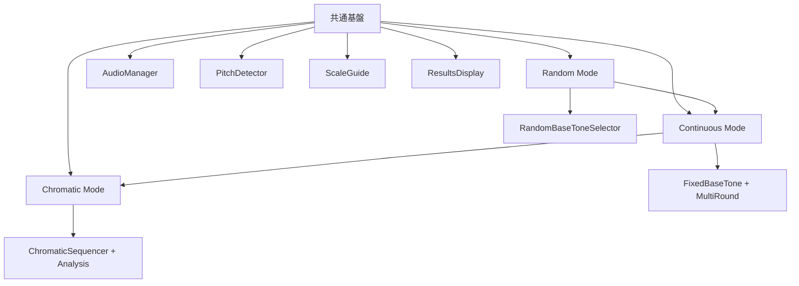

# 3モード機能差分分析・効率的実装仕様書

**作成日**: 2025-08-07  
**更新日**: 2025-08-07（最新仕様書反映版）  
**対象**: Random / Continuous / Chromatic モード  
**目的**: 3モードの機能差分を明確化し、効率的な共通実装戦略を策定  
**参照仕様**: `/Users/isao/Documents/Relative-pitch-app/` 最新仕様書準拠

---

## 🎯 3モード機能差分図

### 📊 モード別機能マトリックス

| 機能分類 | Random Mode | Continuous Mode | Chromatic Mode |
|---------|-------------|-----------------|----------------|
| **基音選択** | C3オクターブ8音ランダム | クロマチック12音ランダム | 全12半音順次 |
| **基音範囲** | C3オクターブ固定 | 12半音すべて | C3-B3 順次上昇 |
| **セッション数** | 8回（総合評価） | 12回連続 | 12-24回 |
| **音階種類** | ドレミファソラシド | ドレミファソラシド | ドレミファソラシド |
| **進行方式** | 1セッション毎評価＋8完了時総合評価 | 自動進行（2秒待機） | 上昇・下降・上昇下降 |
| **評価方式** | 各セッション評価＋8完了でS-E級 | S-E級総合評価 | プロレベル認定 |
| **結果表示** | セッション毎＋総合＋履歴表示 | 12セッション総合 | 音域別精度分析 |
| **統計分析** | 基本 | 統計的誤差吸収 | 半音別傾向分析 |
| **難易度** | 初級（±50¢） | 中級（±50¢） | 上級（±30¢） |

### 🔀 機能継承関係図



---

## 🧩 共通機能 vs 固有機能

### ✅ **共通機能（100%再利用）**

#### 1. **音響処理システム**
```typescript
// 完全共通 - すべてのモードで同一
interface CommonAudioSystem {
  audioManager: AudioManager;           // ✅ 完全共通
  pitchDetector: PitchDetector;        // ✅ 完全共通  
  noiseFilter: NoiseFilter;            // ✅ 完全共通
  harmonicCorrection: HarmonicCorrection; // ✅ 完全共通
}
```

#### 2. **基本UI コンポーネント**
```typescript
// 完全共通 - パラメータのみ異なる
const CommonComponents = {
  PitchDetectionDisplay: true,    // ✅ 完全共通
  VolumeBar: true,               // ✅ 完全共通
  FrequencyDisplay: true,        // ✅ 完全共通
  ScaleGuideDisplay: true,       // ✅ 共通（音階は同じ）
  MicrophoneButton: true,        // ✅ 完全共通
  ErrorNotification: true        // ✅ 完全共通
};
```

#### 3. **基本トレーニングフロー**
```typescript
// すべてのモードで同じ基本フロー
const commonTrainingFlow = [
  'マイクテストページ',
  'トレーニングページ遷移',
  '基音再生（2.5秒）',
  'ドレミファソラシド歌唱',
  '音程検出・判定',
  '結果表示'
];
```

### 🔄 **差分機能（モード固有）**

#### 1. **基音選択戦略（主要差分）**

| モード | 基音選択方法 | 実装クラス |
|--------|------------|----------|
| **Random** | `RandomBaseToneSelector` | 10種からランダム |
| **Continuous** | `FixedBaseToneSelector` | ユーザー選択固定 |
| **Chromatic** | `ChromaticSequencer` | 12音階順次 |

```typescript
// 差分実装例
interface BaseToneStrategy {
  getNextBaseTone(): string;
  isSequenceComplete(): boolean;
  reset(): void;
}

class RandomBaseToneSelector implements BaseToneStrategy {
  getNextBaseTone(): string {
    return randomBaseTones[Math.floor(Math.random() * 10)];
  }
}

class FixedBaseToneSelector implements BaseToneStrategy {
  constructor(private baseTone: string) {}
  getNextBaseTone(): string {
    return this.baseTone; // 常に同じ基音
  }
}

class ChromaticSequencer implements BaseToneStrategy {
  private currentIndex = 0;
  getNextBaseTone(): string {
    return chromaticTones[this.currentIndex++];
  }
}
```

#### 2. **セッション管理戦略（中程度差分）**

| モード | セッション数 | 進行方式 | 実装の違い |
|--------|------------|---------|-----------|
| **Random** | 8回（段階評価） | セッション毎評価＋総合評価 | `DualEvaluationSession` |
| **Continuous** | 12回連続 | 自動進行・2秒待機 | `ContinuousSession` |
| **Chromatic** | 12-24回 | 半音階順次・方向選択 | `ChromaticSession` |

#### 3. **結果処理・統計（中程度差分）**

| モード | 統計種類 | 特殊処理 |
|--------|---------|---------|
| **Random** | 基本統計 | 8音階結果 |
| **Continuous** | 累計統計 | ラウンド間比較 |
| **Chromatic** | 詳細分析 | 音域別分析 |

---

## 🏗️ 効率的実装戦略

### 📋 **戦略1: Strategy Pattern + Composition**

#### 核心設計：差分だけを交換可能にする
```typescript
// 🎯 核心：共通インターフェースで差分を抽象化
interface TrainingStrategy {
  baseToneStrategy: BaseToneStrategy;
  sessionStrategy: SessionStrategy;
  resultStrategy: ResultStrategy;
}

// 🏭 Factory Pattern で戦略を生成
class TrainingStrategyFactory {
  static create(mode: TrainingMode): TrainingStrategy {
    switch (mode) {
      case 'random':
        return {
          baseToneStrategy: new RandomBaseToneSelector(),
          sessionStrategy: new SingleSessionManager(),
          resultStrategy: new BasicResultProcessor()
        };
      
      case 'continuous':
        return {
          baseToneStrategy: new FixedBaseToneSelector(),
          sessionStrategy: new MultiRoundSessionManager(),
          resultStrategy: new CumulativeResultProcessor()
        };
        
      case 'chromatic':
        return {
          baseToneStrategy: new ChromaticSequencer(),
          sessionStrategy: new SequentialSessionManager(),
          resultStrategy: new DetailedAnalysisProcessor()
        };
    }
  }
}
```

### 📋 **戦略2: 共通基盤 + モード固有プラグイン**

#### 共通トレーニングエンジン
```typescript
class UnifiedTrainingEngine {
  // ✅ 完全共通部分
  private audioManager: AudioManager;
  private pitchDetector: PitchDetector;
  private scaleGuide: ScaleGuideDisplay;
  
  // 🔄 差分部分（戦略注入）
  private strategies: TrainingStrategy;
  
  constructor(mode: TrainingMode) {
    // 共通部分の初期化
    this.audioManager = new AudioManager();
    this.pitchDetector = new PitchDetector();
    this.scaleGuide = new ScaleGuideDisplay();
    
    // 差分戦略の注入
    this.strategies = TrainingStrategyFactory.create(mode);
  }
  
  // 🎯 統一インターフェース
  async startTraining(): Promise<void> {
    const baseTone = this.strategies.baseToneStrategy.getNextBaseTone();
    await this.audioManager.playBaseTone(baseTone);
    await this.runTrainingSession();
  }
  
  private async runTrainingSession(): Promise<void> {
    // すべてのモードで同じ基本ロジック
    // 差分は戦略オブジェクトが担当
  }
}
```

### 📋 **戦略3: 設定駆動開発**

#### モード設定による動的制御
```typescript
// 🎯 設定だけでモードを制御
interface TrainingModeConfig {
  mode: 'random' | 'continuous' | 'chromatic';
  baseToneSelection: 'random' | 'fixed' | 'chromatic';
  sessionCount: number;
  autoProgress: boolean;
  analysisLevel: 'basic' | 'detailed' | 'advanced';
}

// 設定例
const modeConfigs: Record<TrainingMode, TrainingModeConfig> = {
  random: {
    mode: 'random',
    baseToneSelection: 'c3_octave_random',
    sessionCount: 8,
    autoProgress: false,
    analysisLevel: 'dual_evaluation', // セッション毎＋総合評価
    tolerance: 50, // ±50セント
    showSessionResults: true, // 各セッション結果表示
    finalEvaluation: true, // 8セッション完了で総合評価
    sessionHistoryEnabled: true // 総合評価画面でセッション履歴表示
  },
  continuous: {
    mode: 'continuous', 
    baseToneSelection: 'chromatic_random',
    sessionCount: 12,
    autoProgress: true,
    analysisLevel: 'statistical',
    tolerance: 50, // ±50セント
    waitTime: 2000 // 2秒待機
  },
  chromatic: {
    mode: 'chromatic',
    baseToneSelection: 'chromatic',
    sessionCount: 12,
    autoProgress: true,
    analysisLevel: 'advanced'
  }
};

// 🏗️ 設定駆動エンジン
class ConfigDrivenTrainingEngine {
  constructor(private config: TrainingModeConfig) {}
  
  // 設定に基づいて動的に動作を決定
  getBaseTone(): string {
    switch (this.config.baseToneSelection) {
      case 'random': return this.getRandomBaseTone();
      case 'fixed': return this.getFixedBaseTone();
      case 'chromatic': return this.getChromaticBaseTone();
    }
  }
}
```

---

## 🛠️ 実装ファイル構成

### 📁 **推奨ファイル構造**

```typescript
src/
├── core/                           // 🎯 完全共通
│   ├── AudioManager.ts            // ✅ 100%共通
│   ├── PitchDetector.ts           // ✅ 100%共通
│   ├── NoiseFilter.ts             // ✅ 100%共通
│   └── HarmonicCorrection.ts      // ✅ 100%共通
├── engines/                        // 🔄 統一エンジン
│   ├── UnifiedTrainingEngine.ts   // 共通ロジック + 戦略注入
│   └── TrainingStrategyFactory.ts // 戦略生成ファクトリー
├── strategies/                     // 🎯 差分実装
│   ├── baseTone/
│   │   ├── RandomBaseToneSelector.ts    // Random固有
│   │   ├── FixedBaseToneSelector.ts     // Continuous固有  
│   │   └── ChromaticSequencer.ts        // Chromatic固有
│   ├── session/
│   │   ├── SingleSessionManager.ts      // Random固有
│   │   ├── MultiRoundSessionManager.ts  // Continuous固有
│   │   └── SequentialSessionManager.ts  // Chromatic固有
│   └── results/
│       ├── BasicResultProcessor.ts      // Random固有
│       ├── CumulativeResultProcessor.ts // Continuous固有
│       └── DetailedAnalysisProcessor.ts // Chromatic固有
├── components/                     // 🎨 UI層
│   ├── common/                    // ✅ 完全共通
│   │   ├── PitchDetectionDisplay.svelte
│   │   ├── ScaleGuideDisplay.svelte
│   │   ├── VolumeBar.svelte
│   │   └── ResultsDisplay.svelte
│   └── mode-specific/             // 🔄 モード固有UI
│       ├── RandomModeSettings.svelte
│       ├── ContinuousModeSettings.svelte
│       └── ChromaticModeSettings.svelte
└── pages/                         // 🌐 ページ層
    └── training/
        ├── random/                // 薄いラッパー
        ├── continuous/            // 薄いラッパー
        └── chromatic/             // 薄いラッパー
```

---

## 🚀 開発効率を最大化する実装順序

### 📋 **Phase 1: 共通基盤構築（1日）**
1. ✅ **AudioManager強化** - 既存を拡張
2. ✅ **PitchDetector統合** - 既存を統一
3. 🆕 **UnifiedTrainingEngine作成** - 新規中核エンジン
4. 🆕 **Strategy インターフェース定義** - 抽象化層

### 📋 **Phase 2: Random Mode完成（1日）**
1. 🔄 **RandomBaseToneSelector** - C3オクターブ8音実装
2. 🆕 **DualEvaluationManager** - セッション毎評価＋8回総合評価システム
3. 🆕 **SessionResultProcessor** - 個別セッション評価表示
4. 🆕 **ComprehensiveEvaluator** - 8セッション完了時のS-E級総合評価
5. 🆕 **SessionHistoryViewer** - 総合評価画面でのセッション履歴表示機能
6. ✅ **段階評価テスト** - セッション毎→総合評価→履歴確認フロー検証

### 📋 **Phase 3: Continuous Mode実装（1日）**
1. 🆕 **FixedBaseToneSelector** - 新規実装
2. 🆕 **MultiRoundSessionManager** - 新規実装
3. 🆕 **CumulativeResultProcessor** - 新規実装
4. 🆕 **ラウンド選択UI** - 新規UI

### 📋 **Phase 4: Chromatic Mode実装（1.5日）**
1. 🆕 **ChromaticSequencer** - 新規実装
2. 🆕 **SequentialSessionManager** - 新規実装  
3. 🆕 **DetailedAnalysisProcessor** - 新規実装
4. 🆕 **音域分析UI** - 新規高度UI

### 📋 **Phase 5: 統合・最適化（0.5日）**
1. 🔧 **パフォーマンス最適化**
2. 🧪 **統合テスト**
3. 📱 **モバイル対応確認**
4. 🚀 **デプロイ・リリース**

**総開発期間: 4.5日（実質約1週間）**

---

## 🎯 効率性のメリット

### 💡 **開発効率**
- **コード重複ゼロ**: 共通部分の完全再利用
- **段階的開発**: Random → Continuous → Chromatic の順次拡張
- **既存資産活用**: 現在のRandomモード実装を基盤に活用

### 🔧 **保守性**
- **責任分離**: 共通処理とモード固有処理の明確な分離
- **テスタビリティ**: Strategy Pattern による単体テストの容易性
- **拡張性**: 新しいモード追加が容易

### 🚀 **性能**
- **メモリ効率**: 共通インスタンスの再利用
- **初期化最適化**: モード切り替え時の最小初期化
- **バンドルサイズ最適化**: 共通コードの最大活用

---

## 🎨 UI差分最小化戦略

### 📊 **Random Mode セッション履歴表示設計**

#### セッション履歴UI仕様
```typescript
interface SessionHistoryProps {
  sessionHistory: SessionResult[];
  currentSessionIndex: number;
  totalSessions: number;
  onSessionSelect?: (sessionIndex: number) => void;
}

interface SessionResult {
  sessionId: number;
  baseTone: string;
  accuracy: number;
  responseTime: number;
  scaleResults: ScaleResult[];
  grade: 'excellent' | 'good' | 'pass' | 'need_work';
  timestamp: Date;
}

// 履歴表示コンポーネント
const SessionHistoryViewer = ({ sessionHistory, currentSessionIndex }: SessionHistoryProps) => {
  return (
    <div className="session-history-container">
      <h3>セッション履歴 ({currentSessionIndex}/8)</h3>
      <div className="session-timeline">
        {sessionHistory.map((session, index) => (
          <SessionHistoryCard 
            key={session.sessionId}
            session={session}
            isActive={index === currentSessionIndex - 1}
            onClick={() => onSessionSelect?.(index)}
          />
        ))}
      </div>
    </div>
  );
};
```

#### 総合評価画面での履歴統合表示
```typescript
const ComprehensiveResultDisplay = ({ finalGrade, sessionHistory }: ComprehensiveResultProps) => {
  return (
    <div className="comprehensive-result">
      {/* S-E級総合評価 */}
      <SEGradeDisplay grade={finalGrade} />
      
      {/* セッション履歴タブ */}
      <Tabs defaultValue="overview">
        <TabsList>
          <TabsTrigger value="overview">総合結果</TabsTrigger>
          <TabsTrigger value="history">セッション履歴</TabsTrigger>
          <TabsTrigger value="analysis">詳細分析</TabsTrigger>
        </TabsList>
        
        <TabsContent value="history">
          <SessionHistoryViewer 
            sessionHistory={sessionHistory}
            currentSessionIndex={8}
          />
        </TabsContent>
      </Tabs>
    </div>
  );
};
```

### 📊 **UI共通化率**

| コンポーネント | 共通化率 | モード固有部分 |
|---------------|---------|--------------|
| **PitchDetectionDisplay** | 100% | なし |
| **VolumeBar** | 100% | なし |
| **ScaleGuideDisplay** | 100% | なし |
| **基音再生ボタン** | 90% | ボタンテキスト |
| **設定パネル** | 30% | モード固有設定 |
| **結果表示** | 70% | 統計の詳細度 |

### 🎯 **設定UI戦略**
```typescript
// 🎛️ 動的設定UI生成
interface SettingConfig {
  key: string;
  type: 'select' | 'number' | 'boolean';
  label: string;
  options?: string[] | number[];
  default: any;
}

const modeSettings: Record<TrainingMode, SettingConfig[]> = {
  random: [
    // 設定項目なし（最小設定）
  ],
  continuous: [
    {
      key: 'baseTone',
      type: 'select', 
      label: '基音',
      options: ['C4', 'D4', 'E4', 'F4', 'G4', 'A4', 'B4'],
      default: 'C4'
    },
    {
      key: 'roundCount',
      type: 'select',
      label: 'ラウンド数', 
      options: [3, 5, 10],
      default: 5
    }
  ],
  chromatic: [
    {
      key: 'direction',
      type: 'select',
      label: '方向',
      options: ['上行のみ', '下行のみ', '上行→下行'],
      default: '上行→下行'
    }
  ]
};

// 🏭 動的UI生成
const SettingsPanel = ({ mode }: { mode: TrainingMode }) => {
  const settings = modeSettings[mode];
  return (
    <div className="settings-panel">
      {settings.map(setting => (
        <SettingField key={setting.key} config={setting} />
      ))}
    </div>
  );
};
```

---

## 📈 成功指標・検証項目

### ✅ **開発効率指標**
- [ ] **コード重複率 < 10%**: 共通機能の効率的再利用
- [ ] **新モード追加工数 < 1日**: 拡張性の実証
- [ ] **バグ修正の波及範囲最小化**: 責任分離の効果

### 🎯 **品質指標**  
- [ ] **3モードすべてで同等の音程検出精度**: 共通基盤の品質
- [ ] **メモリ使用量の線形増加なし**: 効率的リソース管理
- [ ] **モード切り替え時間 < 200ms**: UX品質の維持

### 🚀 **ユーザビリティ指標**
- [ ] **モード選択の直感性**: わかりやすいUI設計
- [ ] **学習曲線の適切性**: 初級→中級→上級の自然な進行
- [ ] **結果比較の有用性**: モード間でのスキル進捗把握

---

## 🎉 まとめ：最適実装戦略

### 🎯 **選択すべき実装戦略**
**「Strategy Pattern + 共通基盤」アプローチ**

**理由**:
1. **最高の効率性**: 共通部分100%再利用、差分のみ個別実装
2. **優れた保守性**: 責任が明確で、変更の影響範囲が限定的  
3. **段階的開発**: 既存のRandomモードを基盤に順次拡張可能
4. **テスタビリティ**: Strategy パターンによる単体テスト容易性

### 🚀 **実装成功のカギ**
1. **共通インターフェースの設計品質**: Strategy パターンの抽象化レベル
2. **既存資産の最大活用**: 現在のRandomモード実装の効率的移行
3. **段階的開発・テスト**: Random完成→Continuous→Chromaticの順次検証

**この設計により、3モードを効率的に実装し、将来の拡張にも対応できる堅牢なアーキテクチャを構築できます。**